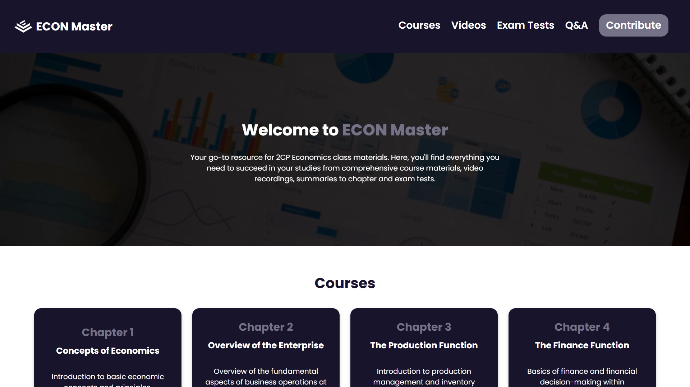
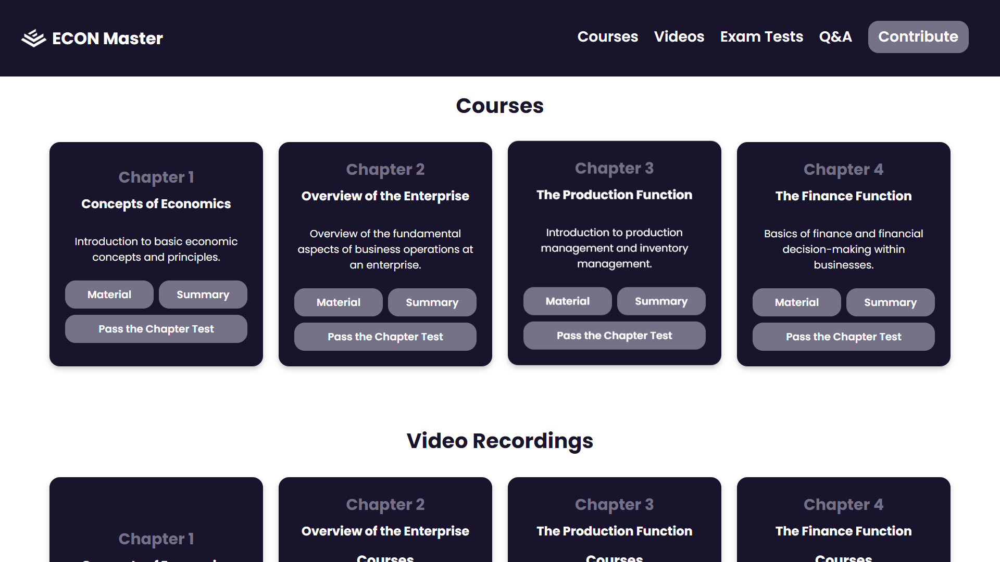
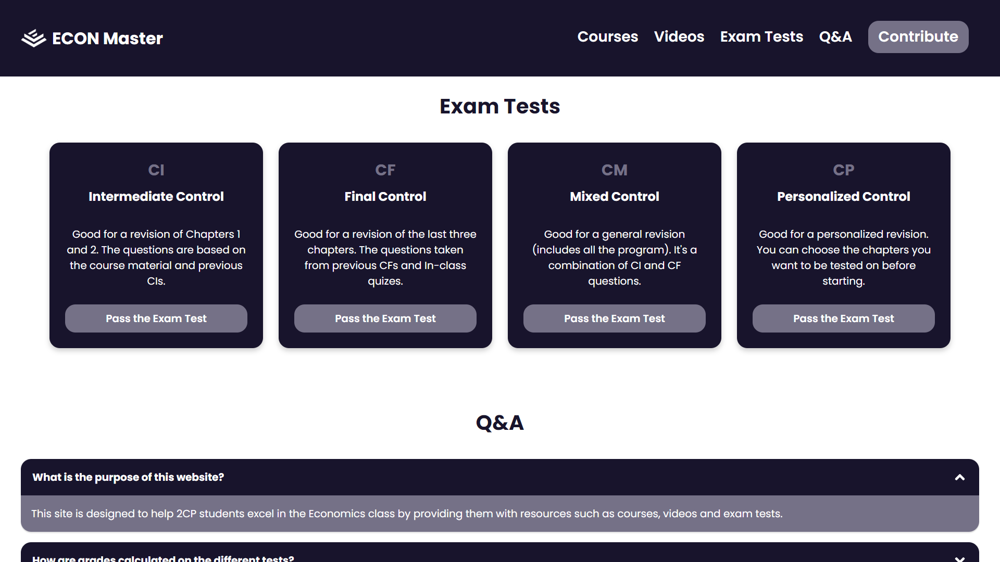
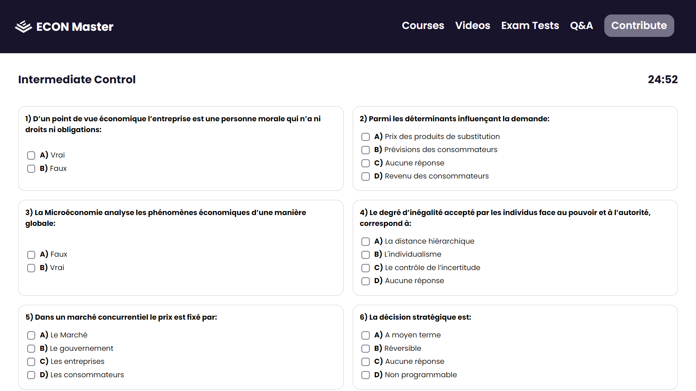
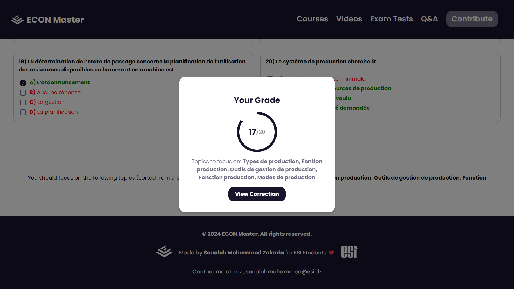
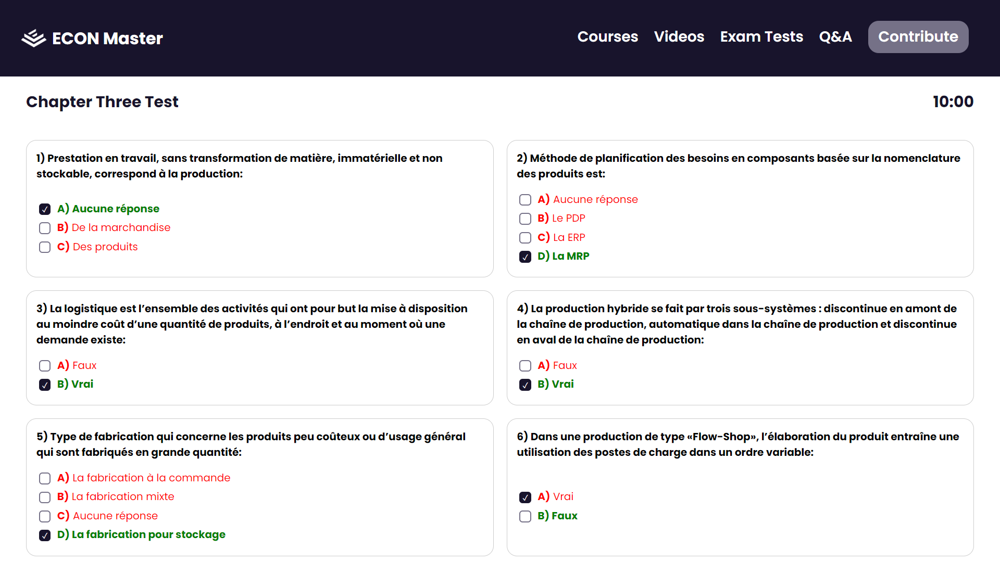

## Overview

ECON Master is a comprehensive platform designed to support 2CP Economics students at ESI. It offers a range of resources, including course materials, video lectures, summaries, and exam practice tests, all aimed at helping students succeed in their studies.

## Features

- **Courses Section**: Access to comprehensive course content and chapter-based tests.
- **Video Recordings Section**: Watch recorded lectures, tutorials and supplementary videos.
- **Exams and Tests Section**: Take intermediate, final, mixed and even presonalized exams.
- **Questions and Answers Section**: Contains some questions and the answers to them.
- **Exam Sheet Page**: View and answer exam questions within a structured sheet layout.
- **Grades Section**: Review graded exam results with performance indicators.
- **Correction Section**: View correct answers with explanations for missed questions.
- **Resource Contribution**:  Upload study materials, notes, questions and summaries.

## License

This project is licensed under the Creative Commons Attribution-NonCommercial-NoDerivatives 4.0 International License. See the [LICENSE](LICENSE) file for details.

